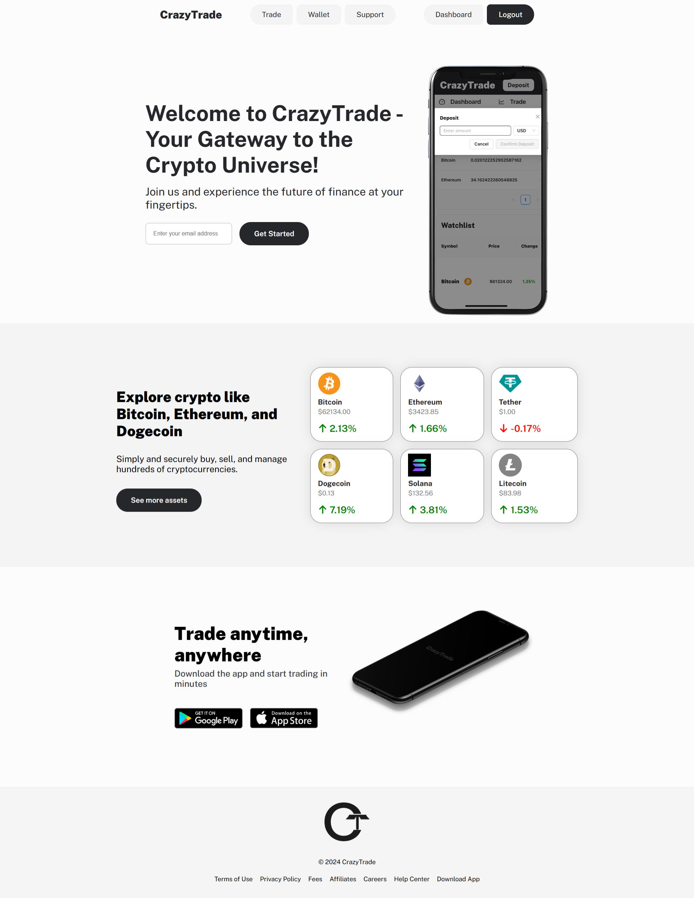
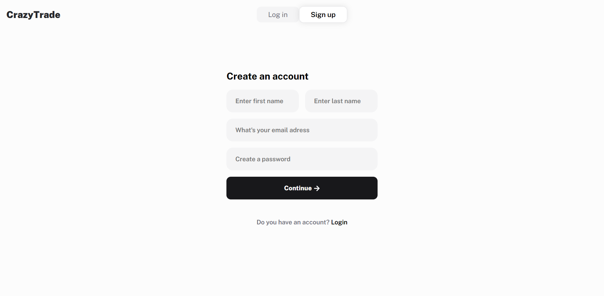
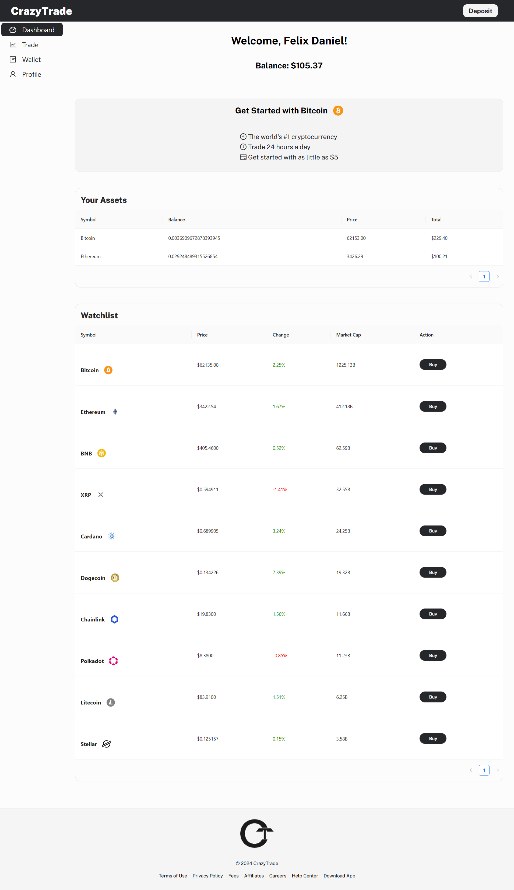

# About the project

Welcome to our Crazy Trade – your gateway to a simplified cryptocurrency trading experience. Dive into the world of digital assets with ease, exploring the features of our user-friendly platform. Test your skills in buying, selling, and monitoring cryptocurrencies in a risk-free environment. This demo app allows you to deposit and withdraw funds securely, providing a glimpse into the convenience of managing your digital assets. Whether you're new to crypto or refining your trading strategies, the demo app is designed to make your learning and exploration process smooth and enjoyable. Experience the excitement of crypto trading without any real-world risks.

Check the live demo: [Live Demo](https://crazy-trade-frontend.vercel.app/)
Demo accounts: 
demo@test.com     password123

**Build with:**

» React JS  
» CSS  
» MongoDB  
» ExpressJS  
» **MERN Full-Stack App**

## Screenshots of the Project

<h3 align='center'>Home Page 🏡</h3>

 
 
<h3 align='center'>Register page 📝</h3>
 

 
 
<h3 align='center'>Dashboard page 📊</h3>
 

 
 
<h3 align='center'>Profile page 👩🏻‍💻</h3>
 

 
 
